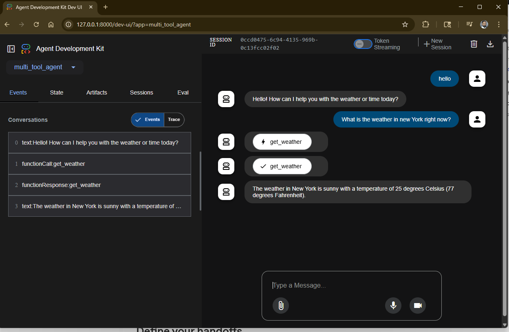

# Create and interact with your first agent using Agent Development Kit (ADK)

This quickstart guides you through installing the Agent Development Kit (ADK), setting up a basic agent with multiple tools, and running it locally either in the terminal or in the interactive, browser-based dev UI.

This repository follows the official [Google ADK Quickstart](https://google.github.io/adk-docs/get-started/quickstart/)

